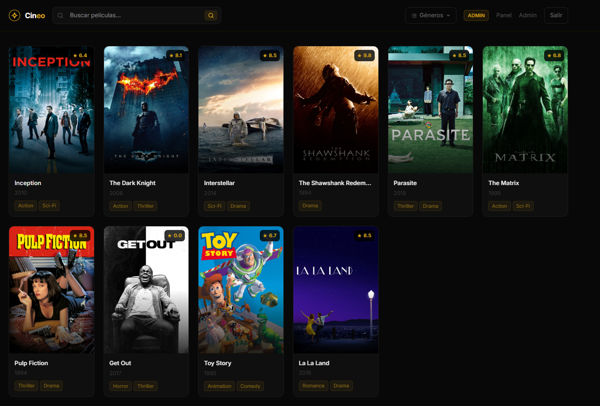
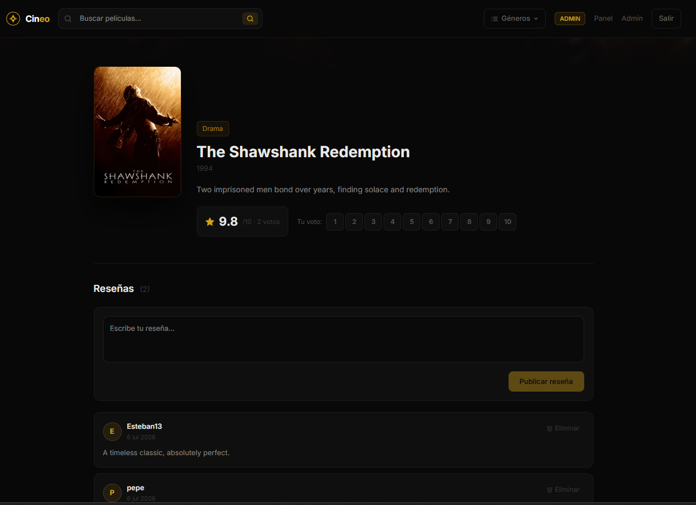
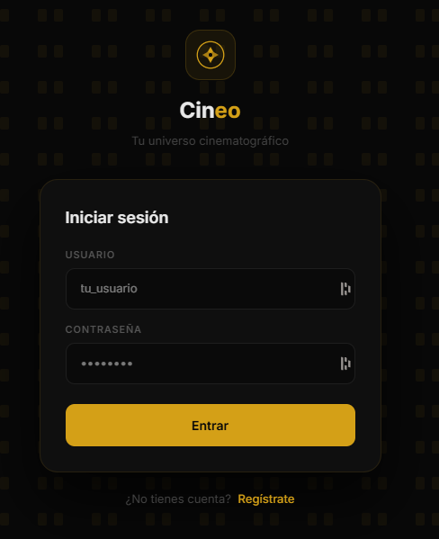
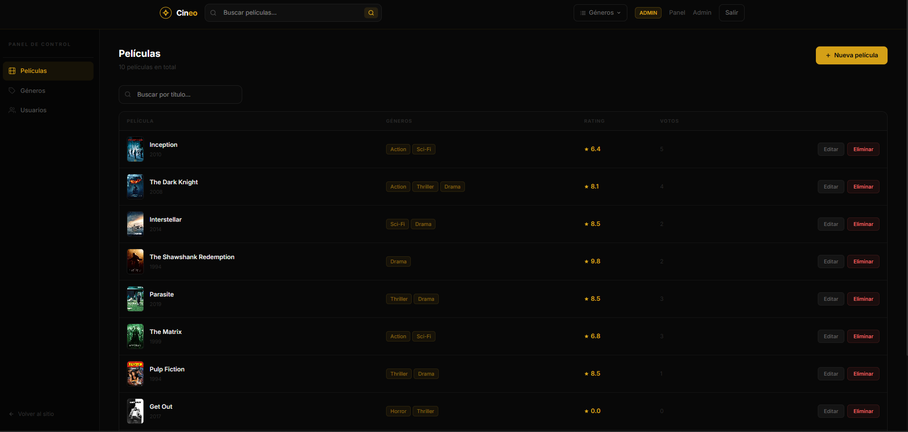

<div align="center">

# 🎬 Cineo Web

### Angular 22 client for the Cineo movie platform

[](https://angular.dev/)
[](https://www.typescriptlang.org/)
[](https://tailwindcss.com/)
[](https://rxjs.dev/)
[](https://github.com/angular/angular/tree/main/packages/zone.js)

</div>

---

## 📖 About

Cineo Web is the web client for **Cineo** — a movie catalogue with ratings and reviews. Built with **Angular 22** standalone components, it consumes the REST API provided by [cineo-api](https://github.com/EstebanMM13/cineo-api), a Spring Cloud microservices backend.

The app uses **RxJS** for async data flows, **Angular Signals** for local component state, and **JWT** tokens stored in localStorage for authentication.

---

## 🖼️ Screenshots

| Home | Movie detail — ratings & reviews |
|---|---|
|  |  |

| Login | Admin panel |
|---|---|
|  |  |

---


## ✨ Features

- Real-time movie search with live navigation
- Genre filtering via navbar dropdown
- Movie detail page with backdrop, description and rating
- 1–10 voting system for authenticated users
- Movie reviews — create, read and delete
- JWT authentication — login and register
- Admin panel to manage movies, genres and users
- Premium dark UI with amber gold accent

---

## 🛠️ Tech Stack

| Layer | Technology |
|---|---|
| Framework | Angular 22 (standalone components) |
| Language | TypeScript 6 |
| Styling | Tailwind CSS 4 + inline styles |
| Async | RxJS 7.8 (switchMap, distinctUntilChanged, takeUntil) |
| State management | Angular Signals (`signal`, `toSignal`) |
| HTTP | Angular HttpClient + JWT interceptor |
| Routing | Angular Router with lazy-loaded components |
| Auth | JWT stored in localStorage, decoded client-side |
| Build | Angular CLI 22 + Vite (esbuild) |

---

## 🚀 Quick Start

### Requirements

- Node.js 20+
- npm 11+
- [cineo-api](https://github.com/EstebanMM13/cineo-api) running on `localhost:8060`

### Run locally

```bash
# Clone the repo
git clone https://github.com/EstebanMM13/cineo-web.git
cd cineo-web

# Install dependencies
npm install

# Start dev server
npm start
```

The app will be available at `http://localhost:4200`.

---

## ⚙️ Environment

The API base URL is configured in `src/environments/environment.ts`:

```typescript
export const environment = {
  apiUrl: 'http://localhost:8060/api/v1'
};
```

Change `apiUrl` if the backend runs on a different port or host.

## 📁 Project Structure

```
src/
├── app/
│   ├── core/
│   │   ├── guards/          # Auth and admin route guards
│   │   ├── interceptors/    # JWT Bearer token interceptor
│   │   ├── models/          # TypeScript interfaces (Movie, Genre, Review...)
│   │   └── services/        # MovieService, GenreService, ReviewService, AuthService
│   ├── features/
│   │   ├── admin/           # Admin panel (movies, genres, users)
│   │   ├── auth/            # Login and register pages
│   │   ├── home/            # Main catalogue with search and genre filter
│   │   └── movie-detail/    # Movie page with voting and reviews
│   └── shared/
│       ├── movie-card/      # Reusable movie poster card
│       ├── navbar/          # Sticky top navigation with genre dropdown
│       └── pagination/      # Page controls
├── environments/
└── styles.css               # Tailwind v4 + global theme
```

---

## 🔐 Authentication

Login returns a **JWT token** which is stored in localStorage and attached to every subsequent request via an `HttpInterceptor`. The token payload contains `userId`, `username` and `role` — decoded client-side to determine access levels without an extra request.

```
POST /api/v1/auth/authenticate  →  { token: "eyJhbGci..." }
                                          ↓
                              localStorage.setItem('token', ...)
                                          ↓
                    Authorization: Bearer eyJhbGci...  (all requests)
```

---

## 📡 API consumed

This app talks to the [cineo-api](https://github.com/EstebanMM13/cineo-api) backend through the API Gateway at port `8060`.

| Service | Endpoints used |
|---|---|
| Auth | `POST /auth/register`, `POST /auth/authenticate` |
| Movies | `GET /movies`, `GET /movies/{id}`, `GET /movies/title`, `GET /movies/genre/{name}`, `PUT /movies/{id}/vote/{rating}` |
| Reviews | `GET /movies/{id}/reviews`, `POST /movies/{id}/reviews`, `DELETE /movies/{id}/reviews/{reviewId}` |
| Genres | `GET /genres` |
| Admin | `POST/PUT/DELETE /movies`, `POST/DELETE /genres`, `GET/DELETE /users` |

---

## 🗺️ Roadmap

- [x] JWT authentication (login + register)
- [x] Movie catalogue with pagination
- [x] Real-time search and genre filtering
- [x] Movie detail with voting system
- [x] Reviews (create + delete)
- [x] Admin panel
- [x] Premium dark UI with gold accent
- [ ] Watchlist / favourites
- [ ] User profile page
- [ ] TMDB integration for automatic posters

---

## 🔗 Related

→ [cineo-api](https://github.com/EstebanMM13/cineo-api) — Spring Cloud microservices REST API

---

## 👨‍💻 Author

**Esteban** — [@estebanmm13](https://github.com/estebanmm13)
